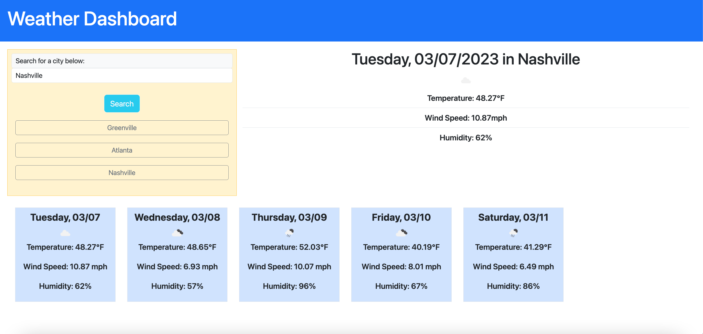

# Weather-Dashboard

## Description

A weather application that utilizes the [5 Day Weather Forecast](https://openweathermap.org/forecast5) API to retrieve weather data for cities for the current day and the next five days. Users’ city searches are stored with localStorage and are displayed on the left hand side of the screen. Once a past searched city is clicked, the user can see the weather for that city again.

## Table of Contents
- [Preview](#preview)
- [Deployed Application](#deployed-application)
- [User Story](#user-story)
- [Features](#features)
- [Acceptance Criteria](#acceptance-criteria)
- [APIs Utilized](#apis-utilized)
- [Credits](#credits)
- [License](#license)

## Preview



## Deployed Application

Weather Dashboard Application: [https://victoriamcn.github.io/Weather-Dashboard/](https://victoriamcn.github.io/Weather-Dashboard/)


## User Story

```
AS A traveler
I WANT to see the weather outlook for multiple cities
SO THAT I can plan a trip accordingly
```

## Features

1. Dynamically updated HTML and CSS
2. When a city is searched, the current weather and a five day forecast for that city appears.
3. All cities searched are extracted from localStorage and appended into a button.
4. When a city from the search history is clicked, that city's forecast reappears.

## Acceptance Criteria

```
GIVEN a weather dashboard with form inputs
WHEN I search for a city
THEN I am presented with current and future conditions for that city and that city is added to the search history
WHEN I view current weather conditions for that city
THEN I am presented with the city name, the date, an icon representation of weather conditions, the temperature, the humidity, and the wind speed
WHEN I view future weather conditions for that city
THEN I am presented with a 5-day forecast that displays the date, an icon representation of weather conditions, the temperature, the wind speed, and the humidity
WHEN I click on a city in the search history
THEN I am again presented with current and future conditions for that city
```
## APIs Utilized

**OpenWeatherMap**
- 5 day weather forecast: [https://openweathermap.org/forecast5](https://openweathermap.org/forecast5)
- Geocoding API: [https://openweathermap.org/api/geocoding-api](https://openweathermap.org/api/geocoding-api)

**Third-Party APIs**
- jQuery: [https://releases.jquery.com/](https://releases.jquery.com/)
- day.js: [https://day.js.org/docs/en/installation/browser](https://day.js.org/docs/en/installation/browser)
- Bootstrap: [https://getbootstrap.com/docs/5.1/getting-started/introduction/](https://getbootstrap.com/docs/5.1/getting-started/introduction/)

## Credits

### Special Thanks To:
- My instructor at Georgia Tech Coding Bootcamp, [Saurav Khatiwada](https://github.com/khatiwadasaurav)
- My tutor, Juan Delgado: He helped me get started with this code, and taught me the magic of string literals.
- My classmate, [Tina Croxton](https://github.com/TinaTheDev91/Weather-Dashboard): They helped me figure out localStorage.
- askBCS Learning Assistant: They helped me figure out how to code my loops for the five-day forecast.

### Tutorials

**APIs**
- The Full-Stack Blog: [How to Use API Keys](https://coding-boot-camp.github.io/full-stack/apis/how-to-use-api-keys)
- StackOverflow: [How to display openweathermap weather icon](https://stackoverflow.com/questions/44177417/how-to-display-openweathermap-weather-icon)
- StackOverflow: [5 day weather forecast on openweathermap not giving expected result](https://stackoverflow.com/questions/63222396/5-day-weather-forecast-on-openweathermap-not-giving-expected-result)
- StackOverflow: [Get 5 day Weather Forecast with JQuery](https://stackoverflow.com/questions/61417301/get-5-day-weather-forecast-with-jquery)
- StackOverflow: [5 Day Forecast Date Not Changing](https://stackoverflow.com/questions/63111463/5-day-forecast-date-not-changing)
- StackOverflow: [Fetch in fetch inside a loop JS](https://stackoverflow.com/questions/60710423/fetch-in-fetch-inside-a-loop-js)

**jQuery**
- [Jquery: How to clear an element before appending new content?](https://stackoverflow.com/questions/13822322/jquery-how-to-clear-an-element-before-appending-new-content#:~:text=You%20can%20use%20.,()%20in%20one%20line%20%3A)&text=Save%20this%20answer.,-Show%20activity%20on)

**localStorage**
- StackOverflow: [search history with localStorage variable in HTML](https://stackoverflow.com/questions/20791533/search-history-with-localstorage-variable-in-html)

**Type Errors**
- Kinsta: [How To Fix the “uncaught typeerror: cannot read property” Error in JavaScript](https://kinsta.com/knowledgebase/uncaught-typeerror-cannot-read-property/)
- testsigma: [Uncaught TypeError: Cannot Read Property of Undefined in JavaScript](https://testsigma.com/blog/uncaught-typeerror-in-javascript/#How_to_fix_uncaught_TypeError)
- StackOverflow: [Uncaught (in promise) TypeError: Cannot read properties of null (reading 'setAttribute')](https://stackoverflow.com/questions/73779528/uncaught-in-promise-typeerror-cannot-read-properties-of-null-reading-setatt)
- StackOverflow: [Uncaught (in promise) TypeError: Cannot read properties of undefined (reading 'data')](https://stackoverflow.com/questions/70625340/uncaught-in-promise-typeerror-cannot-read-properties-of-undefined-reading-d)


### Inspiration / Needed All the Examples for This Challenge
- GitHub User: [jmrendon48](https://github.com/jmrendon48/weather-dashboard-6/blob/main/Assets/js/script.js)
- GitHub User: [ram-sah](https://github.com/ram-sah/Weather-Dashboard/blob/master/Assets/script.js)
- GitHub User: [Gerardo-S](https://github.com/Gerardo-S/5-Day_Forecast/blob/master/app.js)
- GitHub User: [jamierachael](https://github.com/jamierachael/Weather-Dashboard/blob/master/script.js)

## License
Please review in license folder.
